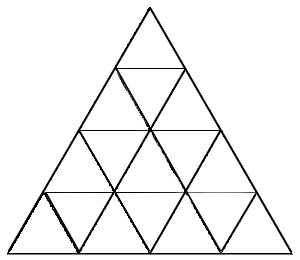

#Mental Representations in Coding

1. Statements. Not everyone can easily tell where a statement starts and ends. Statements are like those puzzles where you have a triangle cut into a bunch of triangles and they ask you how many triangles there are. Examples of where students trip:
  1. Callback nesting - it's confusing to see how a jquery ajax call is just one statement containing a big function.
  2. Multi-line strings.
  3. Angular expressions and promises with dot-chaining long statements.

2. Primitive values

3. Reference Values
  1. Methods/properties - reference values are complex and can have properties
  2. Prototypes/types - ie different kinds of reference values have different properties

4. Functions
  1. Functions that just run code
  2. Functions that take input (parameters)
  3. Functions that return a value (input-output)

5. Loops - yes they are still important
  
3. Algorithms
  1. Find whether element exists in collection
  2. Find min/max element
  3. Find some kind of aggregation of a collection (sum, average, concatenation of array)
  4.
